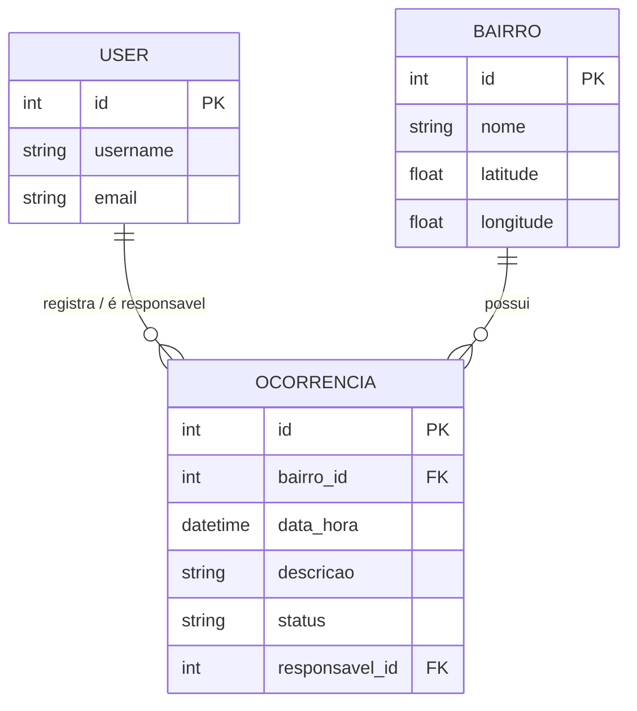
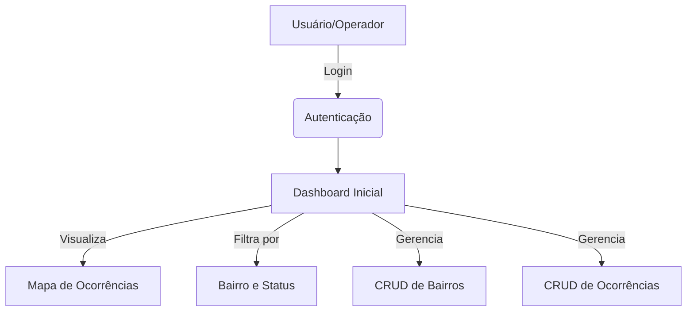

# Apresentação
\
Projeto criado para teste de habilidade técnica do SAAE Juazeiro. Desenvolvido utilizando Python/Django, HTML, CSS e JavaScript  
Requisitos:
```
1. Tela de login.
2. Cadastro de bairros (CRUD).
3. Cadastro de ocorrências contendo: bairro, data/hora, descrição, status (Em
andamento/Resolvido) e responsável.
4. Listagem com pesquisa por bairro e status.
5. Dashboard inicial exibindo: Total de ocorrências, Ocorrências em andamento e
Ocorrências resolvidas  
6. Interface responsiva.
7. Validação de formulários.
8. Banco de dados SQLite.
```

# Documentação
### Entidade - Relacionamento

### Diagrama de caso de uso  


# Como rodar

### Subir o container Docker
1. Abra o Docker Desktop
2. Navegue até a pasta raiz do projeto
3. **Rodar no CMD:**  
```docker-compose up```
4. **Criar superusuário:**
  - ```docker-compose exec web python manage.py createsuperuser```  
    - **Recomendado:**  
      - ```
        Usuário: saae 
        ```
      - ```
        E-mail: deixar vazio
        ```
      - ```
        Senha: Saae1357
        ```
4. **Acesse no navegador:**
<ins>```http://localhost:8000/```</ins>

### Login do usuário root
```
Usuário: saae 
```

```
Senha: Saae1357
```

### Testes automatizados no container
**Rodar:**  
```docker-compose exec web python manage.py test ocorrencias```

### Desligar o container
**Rodar:**\
```docker-compose down```

### Rodar localmente
1. Navegar até a pasta raiz do projeto  
2. **No CMD**:
  - **Criar venv:**
    - ```python -m venv venv```
  - **Ativar venv:**
    - **Windows:**
      - ```venv\Scripts\activate```
    - **Linux/Mac:**
      - ```source venv/bin/activate```  
  - **Instalar dependências:**  
    - ```pip install -r requirements.txt```  
  - **Instalar migrações do banco:**  
    - ```python manage.py migrate```  
  - **Criar superusuário:**
    - ```python manage.py createsuperuser```  
    - **Recomendado:**  
      - ```
        Usuário: saae 
        ```
      - ```
        E-mail: deixar vazio
        ```
      - ```
        Senha: Saae1357
        ```
  - **Iniciar o servidor:**  
    - ```python manage.py runserver```
4. **Acessar no navegador:**   
<ins>```http://127.0.0.1:8000```</ins>

## Testes automatizados localmente
**Rodar:**\
```python manage.py test ocorrencias```
